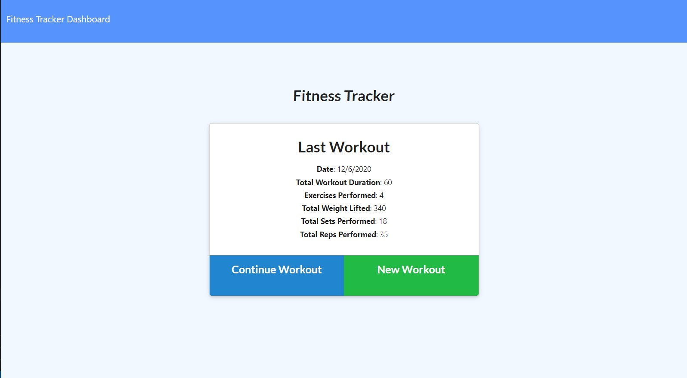

# Fitness Tracker


## Description

The fitness tracker allows a user to keep track of workouts by adding exercises performed which include time elapsed, reps/ sets performed, and/ or distance travelled.

### _Visit this website by clicking the link below_
[Fitness Tracker](https://fitness-tracker117.herokuapp.com/)



## Table of Contents 

* [Installation](#installation)

* [Usage](#usage)

* [License](#license)

* [Contribution Guidelines](#contribution-guidelines)

* [Tests](#tests)

* [Questions](#questions)

## Installation

Run the following command to install dependencies:

```
npm install
```

## Usage

To use this application, from the home page click "New Workout".  Then choose from resistance or cardio from the dropdown. Fill out a series of questions describing the exercise and click "Add Exercise" or "Complete Workout". The workout will be added to the database and specifics of the workout will be displayed on the homepage or more detailed data will be displayed by navigating to the dashboard.

## License

This project is licensed under MIT

## Contribution Guidelines

Currently there are no contribution guidelines for this repo.

## Tests

Run the following command in the terminal to run tests:

```
no tests currently for this repo
```

## Questions

If you have any questions regarding this repo, you may contact me at tniles320@gmail.com. To see my other work, follow this link: [GitHub](https://github.com/tniles320/).